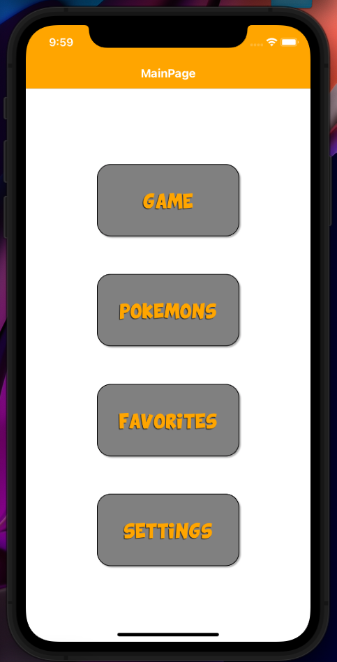
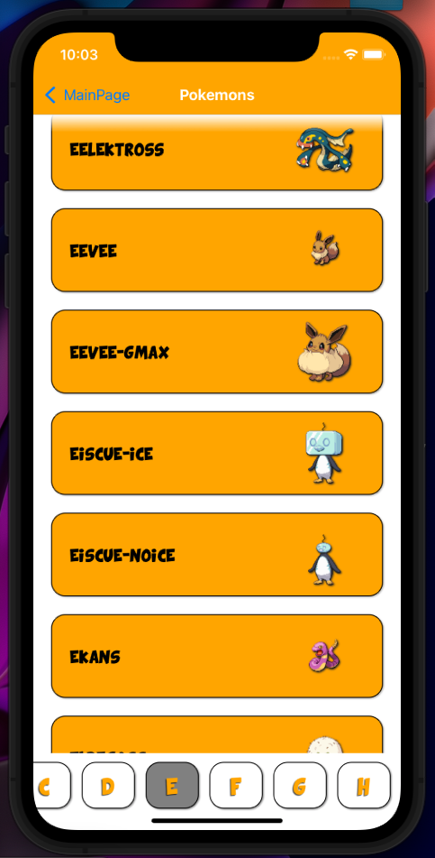
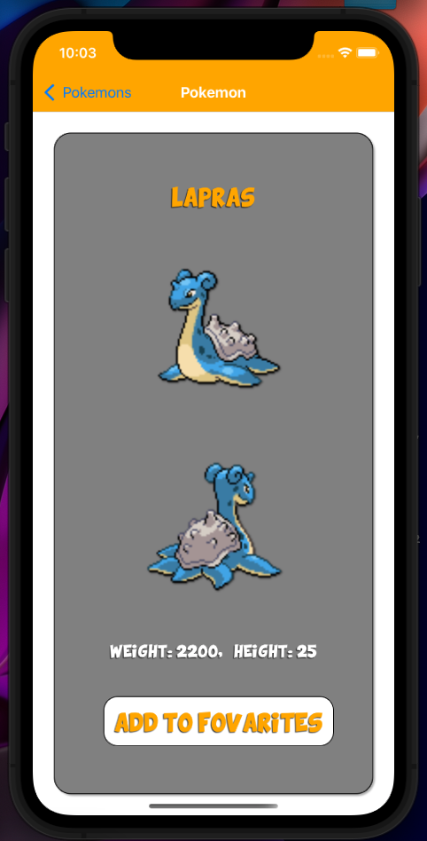
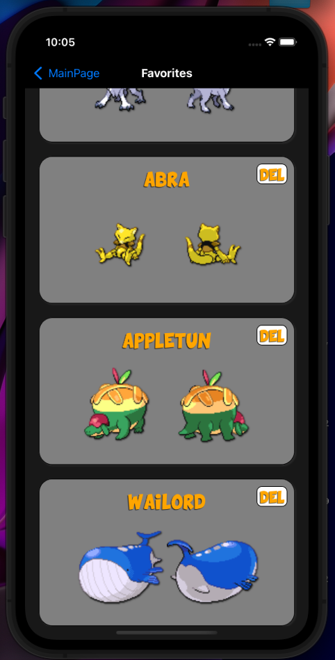
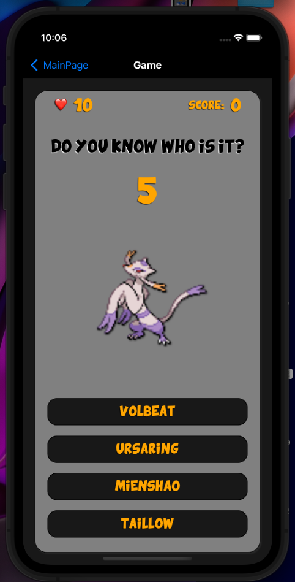
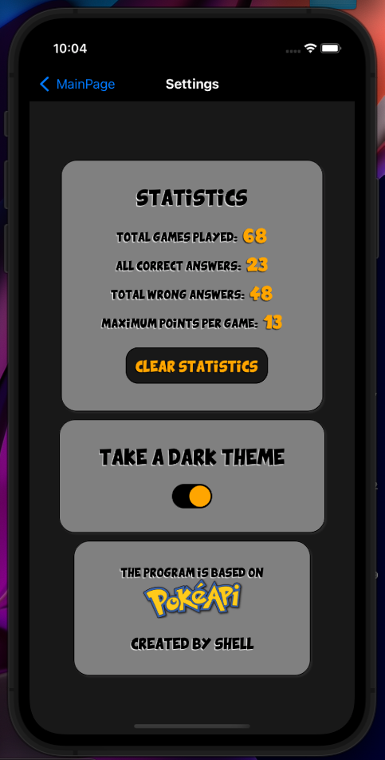

### Pokemon-app:

> Небольшое приложение для iphone. 
> Нет, это приложение не спасет мир и вряд ли сможет решить какие-то глобальные проблемы. Просто список покемонов и просто игра, которая при должном усердии поможет запомнить имена покемонов, 
> Используемые технологии: React, React-Native. 

Для запуска программы программы потребуется установленная программа x-code с настроенным эмулятором iphone. После:

> Скачать репозиторий.

> Перейти в папку с репозиторием

> В консоли ввести npm i или yarn для установки всех необходимых пакетов

> В консоли ввести npm start или yarn start для запуска приложения

> В консоли нажать кнопку i для запуска приложения в эмуляторе.
